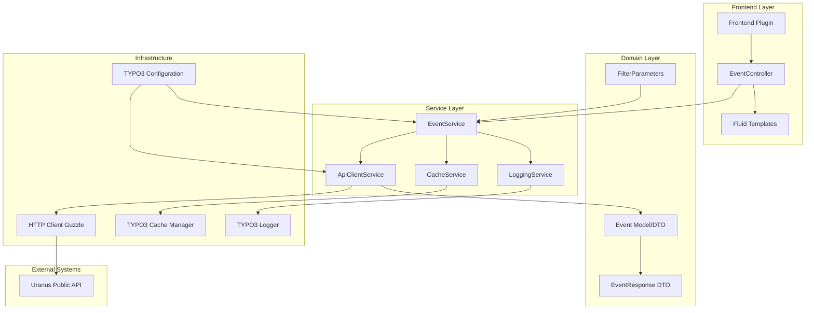

# Architektur-Design für Uranus Events Extension

## Übersicht

Die Extension `uranus_events` lädt Events von der Uranus Public API und stellt sie im TYPO3-Frontend dar. Die Architektur folgt modernen TYPO3 14.1-Standards mit Dependency Injection, strikter Typisierung und klarer Trennung der Verantwortlichkeiten.

## Komponenten-Architektur

## Komponenten-Details

### 1. ApiClientService
- **Verantwortung**: HTTP-Kommunikation mit der Uranus-API
- **Abhängigkeiten**: Guzzle HTTP Client, TYPO3 Configuration
- **Features**:
  - Konfigurierbare Base-URL und Endpoints
  - Query-Parameter-Bildung aus Filter-Parametern
  - HTTP-Fehlerbehandlung und Timeouts
  - JSON-Parsing mit Validierung
  - Retry-Mechanismus bei temporären Fehlern

### 2. EventService
- **Verantwortung**: Geschäftslogik für Event-Abruf und -Verarbeitung
- **Abhängigkeiten**: ApiClientService, CacheService, LoggingService
- **Features**:
  - Filter-Parameter-Validierung
  - Pagination-Logik (limit, offset, last_event_date_id)
  - Daten-Mapping von API-Response zu Domain-Modellen
  - Cache-Strategie-Orchestrierung
  - Fehlerbehandlung und Fallback-Logik

### 3. CacheService
- **Verantwortung**: Caching von API-Responses
- **Abhängigkeiten**: TYPO3 Cache Manager
- **Features**:
  - Tag-basiertes Caching für verschiedene Filter-Kombinationen
  - Konfigurierbare TTL (Time To Live)
  - Cache-Invalidation bei Änderungen
  - Cache-Warmup-Möglichkeiten

### 4. EventController
- **Verantwortung**: Frontend-Controller für Plugin-Ausgabe
- **Abhängigkeiten**: EventService, View (Fluid)
- **Features**:
  - Verarbeitung von Plugin-Einstellungen
  - Übergabe von Daten an Fluid-Templates
  - Pagination-Parameter-Handling
  - Fehlerbehandlung für Frontend

### 5. Domain Models / DTOs
- **Event**: Repräsentiert ein einzelnes Event mit allen Feldern
- **EventResponse**: Container für Events-Array + Pagination-Daten
- **FilterParameters**: Value Object für Filter-Konfiguration

## Datenfluss

1. **Frontend-Request** → Plugin rendert Content Element
2. **EventController** liest Plugin-Einstellungen und erstellt FilterParameters
3. **EventService** prüft Cache für diese Filter-Kombination
4. Bei Cache-Miss: **ApiClientService** ruft Uranus-API auf
5. API-Response wird gemappt zu Event-Objekten
6. Daten werden gecacht und an Controller zurückgegeben
7. **Fluid-Templates** rendern die Event-Liste
8. Pagination-Links werden generiert für weitere Abfragen

## Abhängigkeiten

### Externe Abhängigkeiten
- **Guzzle HTTP Client**: Für API-Kommunikation
- **TYPO3 Core**: Cache, Logging, Configuration API

### PHP-Voraussetzungen
- PHP 8.1+ (kompatibel mit TYPO3 14.1)
- JSON Extension
- cURL Extension

## Konfiguration

### Extension-Konfiguration (`ext_conf_template.txt`)
- `apiBaseUrl`: Basis-URL der Uranus-API
- `apiEndpoint`: Endpoint für Events (default: `/api/events`)
- `cacheLifetime`: Cache-Lebensdauer in Sekunden
- `httpTimeout`: Timeout für API-Aufrufe in Sekunden
- `maxRetries`: Maximale Wiederholungsversuche bei Fehlern

### TypoScript-Konfiguration
- Konstanten für Template-Pfade
- CSS/JS-Assets
- Default-Werte für Filter

## Erweiterbarkeit

Die Architektur ist für folgende Erweiterungen ausgelegt:

1. **Additional API Endpoints**: Neue Services für andere Uranus-Endpoints
2. **Custom Data Sources**: Abstraktion für alternative Event-Quellen
3. **Advanced Filtering**: Erweiterte Filter-Logik mit komplexen Kombinationen
4. **Export-Funktionen**: CSV/JSON-Export von Events
5. **Map Integration**: Karten-Darstellung der Veranstaltungsorte

## Sicherheitsaspekte

- Input-Validierung aller Filter-Parameter
- Output-Escaping in Fluid-Templates
- Rate-Limiting für API-Aufrufe
- Sensible Daten-Logging (keine API-Keys im Log)
- CSRF-Schutz für Formulare (falls implementiert)