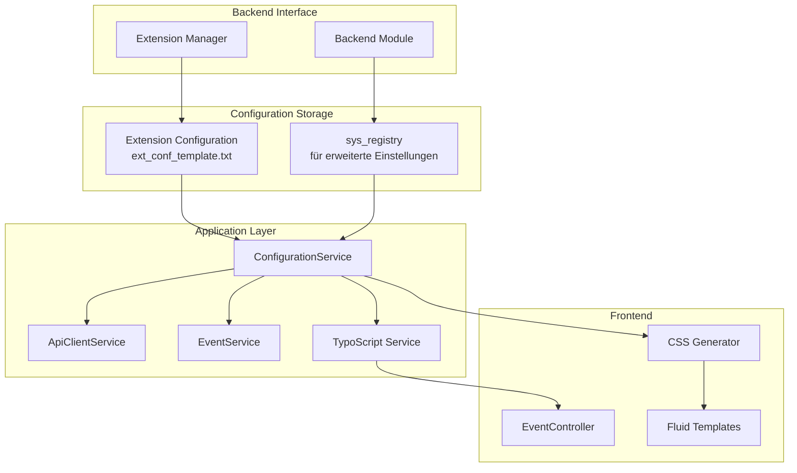

# Backend-Konfigurationsseite für Uranus Events Extension

## Übersicht

Dieses Dokument beschreibt die Implementierung einer Backend-Konfigurationsseite für die Uranus Events Extension, die es Administratoren ermöglicht, alle Einstellungen der Extension zentral zu verwalten.

## Aktueller Stand

Die Extension verfügt bereits über:
- `ext_conf_template.txt` mit 6 Einstellungen (API, Cache, Debug)
- TypoScript-Konstanten für Template-Pfade und Anzeige-Einstellungen
- Extension-Konfiguration in `ext_localconf.php`
- Services, die die Konfiguration über `ExtensionConfiguration` auslesen

## Anforderungen

### 1. Erweiterte Extension-Konfiguration
- **API-Einstellungen**:
  - API Base URL (bereits vorhanden)
  - API Endpoint (bereits vorhanden)
  - HTTP Timeout (bereits vorhanden)
  - Max Retries (bereits vorhanden)
  - API-Key (optional für zukünftige Authentifizierung)

- **Cache-Einstellungen**:
  - Cache Lifetime (bereits vorhanden)
  - Cache-Strategie (tag-based vs. simple)
  - Cache-Warmup-Intervall

- **Debug-Einstellungen**:
  - Debug Mode (bereits vorhanden)
  - Log-Level (error, warning, info, debug)
  - Log-Datei-Pfad

- **Design-Einstellungen** (neu):
  - Primärfarbe (CSS-Variable)
  - Sekundärfarbe
  - Akzentfarbe
  - Schriftarten
  - Border-Radius
  - Box-Shadow-Intensität

- **Anzeige-Einstellungen** (teilweise in TypoScript):
  - Datumsformat
  - Zeitformat
  - Events pro Seite
  - Bilder anzeigen/ausblenden
  - Veranstaltungsort-Karte anzeigen/ausblenden
  - Organisation anzeigen/ausblenden
  - Tags anzeigen/ausblenden

### 2. Konfigurations-Interface-Optionen

**Option A: Erweiterte Extension Manager Konfiguration**
- Erweiterung der `ext_conf_template.txt` mit allen neuen Einstellungen
- Vorteile: Einfach, standardisiert, sofort verfügbar
- Nachteile: Begrenzte UI-Möglichkeiten, keine komplexen Validierungen

**Option B: Eigenes Backend-Modul**
- Dediziertes Modul unter "Uranus Events" → "Configuration"
- Vorteile: Bessere UX, Validierung, Vorschau, Gruppierung
- Nachteile: Mehr Aufwand, muss separat installiert werden

**Option C: Kombination aus beidem**
- Grundlegende Einstellungen in Extension Manager
- Erweiterte Einstellungen in eigenem Backend-Modul
- Beste Lösung für Flexibilität und Benutzerfreundlichkeit

## Empfohlener Ansatz: Option C (Kombination)

### Phase 1: Erweiterung der Extension-Konfiguration
1. Erweiterung von `ext_conf_template.txt` um Design- und Anzeige-Einstellungen
2. Aktualisierung der `ext_localconf.php` Defaults
3. Integration der neuen Einstellungen in Services

### Phase 2: Backend-Modul für erweiterte Konfiguration
1. Erstellung eines Backend-Moduls mit Formular
2. Speicherung der Einstellungen in `sys_registry` oder eigener Tabelle
3. Validierung und Vorschau-Funktionen

## Technische Umsetzung

### 1. Erweiterte ext_conf_template.txt

```typoscript
# cat=basic; type=string; label=API Base URL
apiBaseUrl = https://uranus2.oklabflensburg.de

# cat=basic; type=string; label=API Endpoint
apiEndpoint = /api/events

# cat=cache; type=int+; label=Cache Lifetime (seconds)
cacheLifetime = 3600

# cat=advanced; type=int+; label=HTTP Timeout (seconds)
httpTimeout = 30

# cat=advanced; type=int+; label=Max Retries
maxRetries = 3

# cat=debug; type=boolean; label=Debug Mode
debugMode = 0

# cat=design; type=string; label=Primary Color
primaryColor = #0066cc

# cat=design; type=string; label=Secondary Color
secondaryColor = #333333

# cat=design; type=string; label=Accent Color
accentColor = #ff6600

# cat=design; type=string; label=Font Family
fontFamily = 'Segoe UI', Roboto, 'Helvetica Neue', Arial, sans-serif

# cat=design; type=int+; label=Border Radius (px)
borderRadius = 8

# cat=display; type=string; label=Date Format
dateFormat = d.m.Y

# cat=display; type=string; label=Time Format
timeFormat = H:i

# cat=display; type=int+; label=Events per Page
eventsPerPage = 20

# cat=display; type=boolean; label=Show Images
showImages = 1

# cat=display; type=boolean; label=Show Venue Map
showVenueMap = 1

# cat=display; type=boolean; label=Show Organization
showOrganization = 1

# cat=display; type=boolean; label=Show Tags
showTags = 1
```

### 2. Backend-Modul-Struktur

```
Classes/
├── Controller/
│   └── Backend/
│       └── ConfigurationController.php
├── Service/
│   └── ConfigurationService.php
Resources/
├── Private/
│   ├── Backend/
│   │   ├── Templates/
│   │   │   └── Configuration/
│   │   │       └── Index.html
│   │   └── Language/
│   │       └── locallang.xlf
│   └── CSS/
│       └── backend-configuration.css
Configuration/
├── Backend/
│   ├── Modules.php
│   └── Routes.php
└── Services.yaml (erweitert)
```

### 3. Datenfluss



### 4. CSS-Generator für Design-Einstellungen

Ein Service, der basierend auf den Farb- und Design-Einstellungen dynamisches CSS generiert:

```php
class CssGeneratorService
{
    public function generateDesignCss(array $config): string
    {
        return "
            :root {
                --uranus-primary: {$config['primaryColor']};
                --uranus-secondary: {$config['secondaryColor']};
                --uranus-accent: {$config['accentColor']};
                --uranus-border-radius: {$config['borderRadius']}px;
                --uranus-font-family: {$config['fontFamily']};
            }
            
            .uranus-event-card {
                border-radius: var(--uranus-border-radius);
                border-left: 4px solid var(--uranus-primary);
            }
            
            .uranus-event-title {
                color: var(--uranus-primary);
            }
            
            .uranus-button {
                background-color: var(--uranus-primary);
                color: white;
                border-radius: calc(var(--uranus-border-radius) / 2);
            }
        ";
    }
}
```

## Implementierungsplan

### Schritt 1: Analyse und Planung (abgeschlossen)
- [x] Projektstruktur analysieren
- [x] Anforderungen definieren

### Schritt 2: Extension-Konfiguration erweitern
- [ ] `ext_conf_template.txt` um Design- und Anzeige-Einstellungen erweitern
- [ ] `ext_localconf.php` Defaults aktualisieren
- [ ] `ExtensionConfiguration` in Services integrieren

### Schritt 3: Backend-Modul erstellen
- [ ] Backend-Modul in `Configuration/Backend/Modules.php` registrieren
- [ ] `ConfigurationController` mit Formular-Logik implementieren
- [ ] Fluid-Template für Konfigurations-Interface erstellen
- [ ] Sprachdateien für Backend erstellen

### Schritt 4: Konfigurations-Service implementieren
- [ ] `ConfigurationService` für zentrale Konfigurationsverwaltung
- [ ] `CssGeneratorService` für dynamisches CSS
- [ ] Validierung für alle Einstellungen

### Schritt 5: Integration in Frontend
- [ ] TypoScript-Setup für Konfigurationswerte erweitern
- [ ] EventController anpassen, um Konfiguration zu verwenden
- [ ] Fluid-Templates für CSS-Variablen aktualisieren
- [ ] Cache-Invalidierung bei Konfigurationsänderungen

### Schritt 6: Testing und Dokumentation
- [ ] Backend-Modul im TYPO3-Backend testen
- [ ] Extension-Konfiguration im Extension Manager testen
- [ ] Dokumentation in `README.md` und `Documentation/` aktualisieren
- [ ] Beispiel-Konfigurationen bereitstellen

## Besondere Herausforderungen

### 1. Konfigurations-Priorität
Welche Einstellungen haben Priorität, wenn sie an mehreren Stellen definiert sind?
- Extension Configuration (höchste Priorität)
- Backend-Modul Einstellungen
- TypoScript Constants
- Plugin FlexForm Einstellungen (niedrigste Priorität)

### 2. Cache-Invalidierung
Bei Änderungen der Design-Einstellungen muss der CSS-Cache invalidiert werden.

### 3. Migration bestehender Einstellungen
Bestehende TypoScript-Einstellungen müssen in die neue Konfiguration migriert werden können.

## Erfolgskriterien

1. **Benutzerfreundlichkeit**: Administratoren können alle Einstellungen an einem Ort verwalten
2. **Flexibilität**: Design kann ohne Code-Änderungen angepasst werden
3. **Performance**: Konfiguration wird gecacht und effizient geladen
4. **Kompatibilität**: Abwärtskompatibel mit bestehenden Installationen
5. **Dokumentation**: Alle Einstellungen sind klar dokumentiert

## Nächste Schritte

1. Besprechung des Plans mit dem Entwicklungsteam
2. Priorisierung der Features (MVP vs. vollständige Lösung)
3. Zeitplan für die Implementierung erstellen
4. Entwicklung in iterativen Sprints durchführen