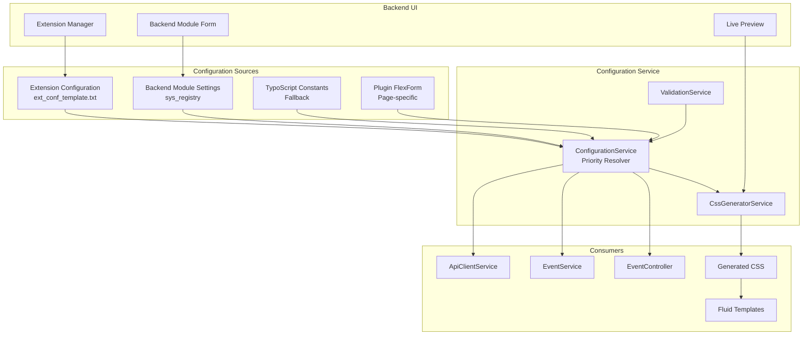

# Design der Backend-Konfigurationsseite

## Entscheidung: Hybrid-Ansatz (Extension Configuration + Backend-Modul)

### Begründung
1. **Extension Configuration** für grundlegende, systemkritische Einstellungen
   - API-URLs, Cache-Lifetime, Timeouts
   - Werden während der Installation/Updates benötigt
   - Einfache Verwaltung über Extension Manager

2. **Backend-Modul** für Design- und Anzeige-Einstellungen
   - Farben, Schriftarten, Layout-Optionen
   - Benutzerfreundliche UI mit Vorschau
   - Häufigere Änderungen erwartet

## Architektur-Übersicht



## Prioritätsreihenfolge (höchste zu niedrigste)

1. **Plugin FlexForm Einstellungen** (seitenspezifisch)
2. **Backend Module Settings** (global, aber überschreibbar)
3. **Extension Configuration** (global, System)
4. **TypoScript Constants** (Fallback, Legacy)

## Extension Configuration Design

### Erweiterte ext_conf_template.txt Struktur

```typoscript
# cat=uranus_api; type=string; label=API Base URL
apiBaseUrl = https://uranus2.oklabflensburg.de

# cat=uranus_api; type=string; label=API Endpoint
apiEndpoint = /api/events

# cat=uranus_cache; type=int+; label=Cache Lifetime (seconds)
cacheLifetime = 3600

# cat=uranus_api; type=int+; label=HTTP Timeout (seconds)
httpTimeout = 30

# cat=uranus_api; type=int+; label=Max Retries
maxRetries = 3

# cat=uranus_debug; type=boolean; label=Debug Mode
debugMode = 0

# cat=uranus_design; type=string; label=Default Primary Color
defaultPrimaryColor = #0066cc

# cat=uranus_design; type=string; label=Default Secondary Color
defaultSecondaryColor = #333333

# cat=uranus_display; type=string; label=Default Date Format
defaultDateFormat = d.m.Y

# cat=uranus_display; type=string; label=Default Time Format
defaultTimeFormat = H:i
```

## Backend-Modul Design

### Modul-Struktur
```
Uranus Events (Hauptmenü)
├── Configuration (Untermenü)
│   ├── General Settings
│   ├── Design Settings
│   ├── Display Settings
│   └── Advanced Settings
└── Event Management (geplant)
    ├── Cache Management
    └── Log Viewer
```

### Formular-Sektionen

#### 1. General Settings
- API Configuration
- Cache Settings
- Debug Settings

#### 2. Design Settings (mit Live-Vorschau)
- Color Picker für Primär-, Sekundär-, Akzentfarben
- Font Family Selector
- Border Radius Slider
- Box Shadow Intensity
- Preview Panel mit Beispiel-Event

#### 3. Display Settings
- Date/Time Format Selector
- Events per Page (Slider)
- Toggle Switches für:
  - Show Images
  - Show Venue Map
  - Show Organization
  - Show Tags
  - Show Excerpt
  - Show Read More Link

#### 4. Advanced Settings
- Log Level Selector
- Cache Strategy (Tag-based vs. Simple)
- HTTP Headers Configuration
- Custom CSS Overrides

### UI/UX Features
1. **Tab-based Navigation** zwischen Sektionen
2. **Live Preview** von Design-Änderungen
3. **Reset to Defaults** Button pro Sektion
4. **Import/Export** von Konfigurationen
5. **Validation** mit Fehlermeldungen
6. **Save & Apply** ohne Seite neu laden

## Datenmodell

### Configuration Entity
```php
class Configuration
{
    // API Settings
    private string $apiBaseUrl;
    private string $apiEndpoint;
    private int $httpTimeout;
    private int $maxRetries;
    
    // Cache Settings
    private int $cacheLifetime;
    private string $cacheStrategy;
    
    // Design Settings
    private string $primaryColor;
    private string $secondaryColor;
    private string $accentColor;
    private string $fontFamily;
    private int $borderRadius;
    private int $boxShadow;
    
    // Display Settings
    private string $dateFormat;
    private string $timeFormat;
    private int $eventsPerPage;
    private bool $showImages;
    private bool $showVenueMap;
    private bool $showOrganization;
    private bool $showTags;
    
    // Debug Settings
    private bool $debugMode;
    private string $logLevel;
    
    // Metadata
    private \DateTime $lastModified;
    private string $modifiedBy;
}
```

### Storage Strategy
1. **Extension Configuration**: `$GLOBALS['TYPO3_CONF_VARS']['EXTENSIONS']['uranus_events']`
2. **Backend Module Settings**: `sys_registry` mit Namespace `tx_uranusevents.configuration`
3. **Cache**: Separate Cache-Entry für generiertes CSS

## Implementation Phases

### Phase 1: MVP (Minimal Viable Product)
- Erweiterte Extension Configuration
- Einfaches Backend-Modul ohne Vorschau
- Grundlegende Design-Einstellungen
- Integration in bestehende Services

### Phase 2: Enhanced UI
- Tab-basierte Navigation
- Live Preview für Design
- Import/Export Funktion
- Validierung und Fehlerbehandlung

### Phase 3: Advanced Features
- Multi-site Support (unterschiedliche Konfigurationen pro Site)
- A/B Testing für Design-Varianten
- Analytics Integration (welche Einstellungen werden verwendet)
- Bulk Operations

## Technische Details

### ConfigurationService
```php
class ConfigurationService
{
    public function getMergedConfiguration(): array
    {
        // 1. Extension Configuration als Basis
        $extensionConfig = $this->extensionConfiguration->get('uranus_events');
        
        // 2. Backend Module Settings (überschreibt Extension)
        $moduleConfig = $this->registry->get('tx_uranusevents', 'configuration');
        
        // 3. TypoScript Constants als Fallback
        $typoscriptConfig = $this->typoscriptService->getSettings();
        
        // Merge mit Priorität
        return array_merge(
            $typoscriptConfig,        // Lowest priority
            $extensionConfig,         // Medium priority
            $moduleConfig             // Highest priority
        );
    }
    
    public function generateCss(): string
    {
        $config = $this->getMergedConfiguration();
        return $this->cssGenerator->generate($config);
    }
}
```

### Backend Controller
```php
class ConfigurationController extends ActionController
{
    public function indexAction(): ResponseInterface
    {
        $configuration = $this->configurationService->getCurrentConfiguration();
        $this->view->assign('configuration', $configuration);
        $this->view->assign('previewCss', $this->cssGenerator->generate($configuration));
        return $this->htmlResponse();
    }
    
    public function saveAction(array $configuration): ResponseInterface
    {
        $this->validationService->validate($configuration);
        $this->configurationService->save($configuration);
        $this->cacheService->flushCssCache();
        $this->addFlashMessage('Configuration saved successfully');
        return $this->redirect('index');
    }
}
```

## Migration von bestehenden Einstellungen

### Migration Path
1. **TypoScript Constants** → Backend Module Settings
   - Automatische Migration beim ersten Aufruf des Backend-Moduls
   - Option zur manuellen Bestätigung

2. **Plugin FlexForm** Settings bleiben unverändert
   - Haben weiterhin höchste Priorität
   - Können im Backend-Modul als "Page-specific overrides" angezeigt werden

## Testing Strategy

### Unit Tests
- ConfigurationService: Priority merging
- ValidationService: Input validation
- CssGeneratorService: CSS output correctness

### Integration Tests
- Backend Module: Form submission
- Extension Configuration: Saving/loading
- Frontend: CSS application

### Browser Tests
- Backend UI: User interaction
- Live Preview: Real-time updates
- Responsive Design: Mobile/desktop

## Erfolgsmetriken

1. **Performance**: Konfigurationsabfrage < 50ms
2. **Usability**: < 3 Klicks zu häufig verwendeten Einstellungen
3. **Reliability**: 100% Testabdeckung für kritische Pfade
4. **Adoption**: > 80% der Installationen verwenden das Backend-Modul

## Nächste Schritte

1. **Review** dieses Designs mit dem Entwicklungsteam
2. **Priorisierung** der Features für Phase 1
3. **Schätzung** des Aufwands für jede Phase
4. **Entwicklung** gemäß Agile/Scrum Methodologie